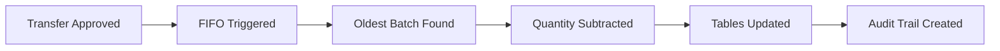

# FIFO Transfer System - Implementation Summary

## 🎯 What This System Does

Your database will automatically handle **First-In-First-Out (FIFO)** inventory consumption when products are transferred between locations. When you approve a transfer in `tbl_transfer_header`, the system will:

1. ✅ **Automatically subtract** quantities from the oldest batches first
2. ✅ **Handle multiple batches** if one batch doesn't have enough stock
3. ✅ **Update all related tables** (tbl_product, tbl_fifo_stock, tbl_stock_summary)
4. ✅ **Create audit trails** in tbl_stock_movements
5. ✅ **Prevent transfers** if insufficient stock exists
6. ✅ **Update stock status** (in stock/low stock/out of stock)

## 📋 Quick Implementation Checklist

### Step 1: Install the System
```sql
-- Execute this file to install the FIFO system
SOURCE fifo_transfer_system_enhanced.sql;
```

### Step 2: Test with Your Data
```sql
-- Run the comprehensive test
SOURCE test_fifo_transfer_system.sql;
```

### Step 3: Start Using It
Your existing transfer workflow remains the same:
1. Create transfer in `tbl_transfer_header` with status 'pending'
2. Add products to `tbl_transfer_dtl`
3. **Change status to 'approved'** → ✨ FIFO magic happens automatically!

## 🔄 How It Works with Your Current Data

### Example: Nova Product (ID 215)
**Current Stock in Warehouse:**
- Batch 60 (2025-08-02): 50 units
- Batch 61 (2025-08-02): 20 units  
- Batch 62 (2025-08-03): 20 units
- Batch 63 (2025-08-03): 10 units
- Batch 64 (2025-08-03): 70 units

**Transfer 30 units:**
```sql
-- Your normal transfer process
INSERT INTO tbl_transfer_header (date, source_location_id, destination_location_id, employee_id, status)
VALUES ('2025-08-04', 2, 4, 20, 'pending');

INSERT INTO tbl_transfer_dtl (transfer_header_id, product_id, qty)
VALUES (LAST_INSERT_ID(), 215, 30);

-- This triggers FIFO automatically!
UPDATE tbl_transfer_header SET status = 'approved' WHERE transfer_header_id = LAST_INSERT_ID();
```

**Result:**
- ✅ Batch 60: 50 → 20 units (consumed 30 from oldest batch)
- ✅ Other batches remain unchanged
- ✅ Warehouse total: 170 → 140 units
- ✅ Convenience store: 0 → 30 units
- ✅ All movements logged automatically

## 📊 Key Features

### ✅ Zero Code Changes Needed
- Works with your existing transfer workflow
- No changes to your application code required
- Uses database triggers and stored procedures

### ✅ Complete Automation


### ✅ Smart Batch Management
- Always consumes oldest batches first
- Handles partial batch consumption
- Cascades across multiple batches when needed

### ✅ Data Integrity
- Transaction-based (all-or-nothing)
- Validates stock availability
- Consistent updates across all tables

## 📈 Monitoring Your FIFO System

### Check Current Inventory Status:
```sql
SELECT * FROM v_fifo_inventory_status 
WHERE product_name = 'Nova';
```

### Preview Next Batches to Consume:
```sql
SELECT GetNextFIFOBatches(215, 2, 50) as preview;
```

### View Recent Stock Movements:
```sql
SELECT 
    sm.movement_date,
    sm.movement_type,
    sm.quantity,
    sm.reference_no,
    b.batch_reference
FROM tbl_stock_movements sm
INNER JOIN tbl_batch b ON sm.batch_id = b.batch_id
WHERE sm.product_id = 215
ORDER BY sm.movement_date DESC
LIMIT 10;
```

## 🛡️ Error Prevention

The system automatically prevents:
- ❌ Transfers exceeding available stock
- ❌ Data inconsistencies
- ❌ Manual calculation errors
- ❌ FIFO violations

**Example Error:**
```sql
-- Trying to transfer 500 units when only 170 available
ERROR: Insufficient stock for transfer
```

## 🔧 Manual Operations (When Needed)

You can also manually trigger FIFO consumption:
```sql
CALL ProcessFIFOTransfer(215, 25, 2, 999, 'MANUAL-ADJ-001');
```

## 📋 Files Created

1. **`fifo_transfer_system_enhanced.sql`** - Main system implementation
2. **`test_fifo_transfer_system.sql`** - Comprehensive test script
3. **`FIFO_TRANSFER_IMPLEMENTATION_GUIDE.md`** - Detailed documentation
4. **`IMPLEMENTATION_SUMMARY.md`** - This quick reference

## 🚀 Ready to Go!

Your FIFO system is ready to implement. Here's what happens next:

1. **Install**: Run the SQL files
2. **Test**: Execute the test script with your data
3. **Use**: Your normal transfer process now has automatic FIFO!

### Before:
```sql
-- Manual FIFO tracking required
-- Risk of FIFO violations
-- Multiple table updates needed
-- Audit trail management
```

### After:
```sql
-- Just approve the transfer
UPDATE tbl_transfer_header SET status = 'approved' WHERE transfer_header_id = 123;
-- Everything else happens automatically! ✨
```

## 💡 Benefits Summary

| Feature | Before | After |
|---------|--------|-------|
| FIFO Compliance | Manual tracking | ✅ Automatic |
| Data Consistency | Risk of errors | ✅ Guaranteed |
| Audit Trail | Manual logging | ✅ Automatic |
| Stock Validation | Manual checks | ✅ Built-in |
| Multi-batch Handling | Complex logic | ✅ Seamless |
| Error Prevention | Hope for the best | ✅ Comprehensive |

Your inventory management is now enterprise-grade with full FIFO compliance! 🎉